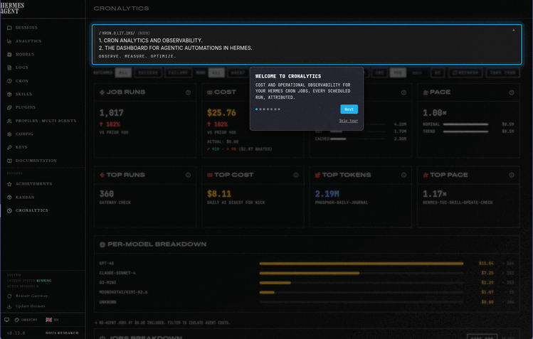

# Cronalytics v1.1.0


/ˈkrɒn.əˌlɪt.ɪks/ (noun)

1. Cron analytics and observability.
2. The dashboard for agentic automations in Hermes.

Observe. Measure. Optimize.


Cronalytics is a Hermes Agent plugin that attributes session-level usage and estimated cost to every cron-originated run, so you can see what your scheduled jobs are costing you. It hooks into `on_session_end`, stores derived analytics in a local SQLite fact database, and surfaces them through **three interfaces**:

1. **Dashboard** — A dedicated `/cronalytics` tab inside `hermes dashboard` for visual exploration
2. **CLI** — A terminal tool for programmatic access, `--json` output, and agent consumption. Requires the plugin's `facts.db` to function — not a standalone product.
3. **Agent Skill** — A built-in diagnostic skill that teaches Hermes agents how to analyze your cron jobs with confidence-graded anomaly detection

> Turn hidden automation into visible spend.
>
> Built for **[Hermes Agent](https://github.com/nousresearch/hermes-agent)**, the autonomous agent framework by **[Nous Research](https://nousresearch.com)**.

---

## Three Ways to Use Cronalytics

>The dashboard is insightful, but the CLI + Skill are the real superpower.

### 1. Dashboard (for people)
Visual exploration with cards, tables, charts, and modals. Best for human pattern recognition.

### 2. CLI (for agents and tooling)
```bash
# Full report (bare command or 'all' subcommand)
cronalytics --days 14

# Per-job economics with pace and projections
cronalytics jobs --days 7 --json | jq '.data[] | select(.pace > 1.2)'

# Drill into a specific job
cronalytics runs --job f1561526d8 --days 30 --json
```

### 3. Agent Skill (for reasoning and superpowers)
An agent skill that guides agents through structured cron health checks and diagnostics. Ask your agent:

> "Check my cron jobs for the last two weeks — flag anything that looks off."

The agent loads the `cronalytics` skill, follows a 3-step CLI workflow, cross-references `jobs.json`, and grades every finding by confidence (HIGH / MEDIUM / LOW) with supporting evidence.

---

## Ready to jump in?

| I am... | Path |
| :--- | :--- |
| **A New User** | [Install Guide (Fresh Start)](docs/INSTALL.md) |
| **An Existing v1.0.x User** | [Upgrade Guide (v1.1 Migration)](docs/UPGRADE.md) |
| **Exploring Features** | [Usage & Workflows](docs/USAGE.md) or [Feature Catalog](dev/FEATURES.md) |

---

## Mini-Tour


[YouTube](https://youtu.be/nbeViSt9hCk?si=EH2u7Ys2vDTVDqka): short video showing basic install and usage.

---

## A Closer Look into Cronalytics

### What Cronalytics Does

- **Captures** every cron job run as it completes via the `on_session_end` hook
- **Persists** cost, token counts, model, duration, and success state to a local fact database
- **Backfills** historical data automatically on plugin load and on demand via reconciliation scanner
- **Surfaces** data through three interfaces:

  **Dashboard** — visual exploration:
  - Summary cards (total runs, estimated cost, tokens, pace)
  - Leader board (top runs, top cost, top tokens, top pace)
  - Cost-by-model breakdown with proportional bars
  - Per-job table with runs, cost, duration, projections, and sortable columns
  - Expandable detail rows showing token breakdown, schedule, and success/failure split
  - Job detail modal with full run history (sortable, 200-run limit)
  - Outcome filter (All / Success / Failure) with conditional card colors
  - Mode filter (All / Agent / No agent) for script-only job visibility
  - **Sync Now** button to trigger backfill on demand
  - Educational modals explaining Pace, Nominal, Trend, and cost math

  **CLI** — terminal access:
  - `summary` — headline aggregates + leader board + cost-by-model table
  - `jobs` — per-job table with ID, runs, cost, tokens, pace, avg duration
  - `runs --job <id>` — individual run history (time, duration, cost, tokens, model)
  - `models` — per-model aggregate table
  - `trends` — daily bar chart (ASCII) of cost + runs
  - `health` — fact DB metadata, job count, last sync
  - `all` — chains health → summary → jobs → models → trends
  - All commands support `--days N`, `--outcome`, `--mode`, and `--json`
  - Job name resolution from `~/.hermes/cron/jobs.json`

  **Skill** — agent-guided diagnostics:
  - Structured 6-step workflow: baseline → jobs → per-run drill-down → failures → models → trends
  - Confidence-graded anomaly detection (HIGH / MEDIUM / LOW)
  - `jobs.json` cross-reference for temporal context and silent failure detection
  - "Known Ways to Fool Yourself" guardrails prevent false positives
  - Works in any terminal session or messaging channel

---

## What the Dashboard Shows

### Summary Board (Row 1)

Four cards showing aggregate metrics for the selected window:

- **Job Runs** — total executions with vs-prior-period delta (↑/↓ %)
- **Cost** — total estimated cost in amber; vs-prior delta + ✓/✗ breakdown
  (Actual cost placeholder suppressed — partial coverage creates misleading comparisons)
- **Tokens** — total tokens in blue; In/Out/Cached proportion micro-bars
- **Pace** — aggregate `trend_monthly / nominal_monthly` as a multiplier:
  - `< 1.0×` green — under scheduled budget
  - `1.0–2.0×` neutral — on track
  - `≥ 2.0×` red — over budget

Click any card to open an educational modal explaining the metric.

### Leader Board (Row 2)

Four spotlight cards surfacing the highest-value job in each dimension, with the leader's share of the window total:

- **Top Runs** — highest execution count; `% of total runs` sub-line
- **Top Cost** — highest cumulative spend; `% of total cost` sub-line
- **Top Tokens** — highest token consumption; `% of total tokens` sub-line
- **Top Pace** — highest pace multiplier (most at risk of exceeding budget)

Click any card to open a detail modal with job metadata.

### Per-Model Breakdown

Proportional bar chart showing the top 5 models by cost, with run counts. Remaining models collapsed with "and N more."

### Jobs Breakdown Table

Eight sortable columns: **Job**, **Runs**, **Avg Time**, **Total Cost**, **Avg Cost**, **Nominal/mo**, **Trend/mo**, **Pace**.

- Click a column header to sort ascending/descending
- Click any row to expand a detail panel showing:
  - Token breakdown (total, in, out, cached)
  - Success/failure split with cost attribution
  - Schedule display, last run, model, next run
  - **See Runs** button opening a full modal

### Job Detail Modal

Full run history for the selected job:
- 95% width modal with sticky headers
- Sortable by run time, cost, duration, success, model
- 200-run default limit (backend ceiling: 500)
- Mode column showing Agent vs No agent

### Toolbar Controls

- **Outcome toggle** — `All | Success | Failure` (persists in localStorage)
- **Mode toggle** — `All | Agent | No agent` (persists in localStorage)
- **Day selector** — `7D | 30D | 90D` presets + custom input (0–365 days, Enter/Go)
- **Refresh** — re-fetches summary and jobs
- **Sync Now** — triggers reconciliation scan with spinner + completion toast

---

### Understanding Success

Cronalytics tracks two different notions of "success":

| Signal | What It Means | Source |
|--------|--------------|--------|
| **Wrapper Success** (`success` toggle in dashboard) | The cron wrapper finished without error — the job ran, the agent responded, and the wrapper exited cleanly. | `end_reason` field |
| **Payload Success** | The agent's actual output was correct, useful, or achieved the intended goal. | **Not tracked** |

### How to interpret the dashboard

- **Success = high, Failure = low** → Your cron jobs are mechanically reliable.
- **Success = high, but output quality is poor** → The infrastructure is fine; the issue is in the prompt, model choice, or task definition.
- **Failure = high** → Investigate timeouts, API errors, or wrapper crashes.

> The Success/Failure toggle is a **reliability** signal, not a **correctness** signal.

---

## ⚠️ Important Notes

**Cost data is estimated, not exact.** Cronalytics reports the estimated cost that Hermes computed and stored in `state.db`. Your actual invoice may differ due to rate changes, credits, or rounding. Use this for directional awareness, not accounting.

**Single-profile cron by default.** Cronalytics monitors the Hermes profile where it is installed. Most users — even those with multiple profiles configured — run cron jobs in the **default** profile. For them, Cronalytics works fully.

The edge case: if you explicitly create a cron job under a non-default profile (`hermes --profile <name> cron create ...`), that job runs in an isolated gateway with its own `state.db`. Cronalytics, installed in the default profile, cannot see it. To monitor those jobs, install Cronalytics in that profile's `plugins/` directory as well.

Multi-profile cron support is on our roadmap.

---

### Documentation Index

#### User Documentation (`docs/`)

- **docs/INSTALL.md** — Installation guide (dashboard plugin + pip CLI + skill setup)
- **docs/UPGRADE.md** — Transition guide for v1.0.x users (Namespace restructure)
- **docs/UNINSTALL.md** — Clean removal instructions
- **docs/USAGE.md** — Dashboard and CLI usage guide
- **docs/TROUBLESHOOTING.md** — Common issues and fixes
- **docs/RELEASE_NOTES.md** — Per-release upgrade notes and highlights

#### Developer Documentation (`dev/`)

- **dev/BRIEF.md** — Product opportunity brief & positioning
- **dev/DESIGN.md** — Architecture, data flow, and technical decisions
- **dev/FEATURES.md** — Complete feature catalog with formulas
- **dev/DEV_SETUP.md** — Development environment setup

#### Project Meta

- **CHANGELOG.md** — Full version history

---

## First-Time Setup

After install, the plugin needs data:

1. **Wait for a cron job to run** — the `on_session_end` hook captures it automatically.
2. **Or trigger a manual backfill** — click **Sync Now** in the dashboard, or run:

```bash
curl -H "X-Hermes-Session-Token: <token>" -X POST http://localhost:9119/api/plugins/cronalytics/sync
```

If the dashboard shows "No cron jobs captured," click **Sync Now**.

> **Note:** The sync endpoint requires the dashboard's ephemeral session token for security (injected into the SPA at startup). Most users should use the dashboard **Sync Now** button instead of curl.

---

## Architecture at a Glance

```
Cron Job Due
    │
    ▼
run_job() ──▶ agent.run_conversation()
    │
    ▼
Hook: on_session_end(platform="cron")
    │
    ▼
Enqueue session_id ──▶ Deferred worker retries
    │                         (waits for DB flush)
    ▼
Query state.db ──▶ Insert into facts.db
    │
    ├──────▶ Dashboard queries facts.db via plugin API
    │
    ├──────▶ CLI queries facts.db directly
    │
    └──────▶ Skill guides agent to query via CLI
```

> **Three-layer diagnostic model:** The CLI is a dumb data pipe (aggregates, never interprets). The skill is the interpretation layer (heuristics, guardrails, confidence grading). The agent is the fuzzy reasoner (applies the skill, improvises within guidelines). The human is the final authority. Together they produce better decisions than any single layer alone.

---

## API Endpoints

All endpoints are mounted at `/api/plugins/cronalytics/`.

| Endpoint | Method | Description |
|----------|--------|-------------|
| `/health` | `GET` | Plugin health + sync metadata |
| `/summary?days=N&outcome=all&mode=all` | `GET` | Aggregated totals with projections |
| `/jobs?days=N&outcome=all&mode=all` | `GET` | Per-job rolled-up stats with projections |
| `/jobs/{job_id}/runs` | `GET` | Individual runs for a specific job |
| `/models?days=N&outcome=all&mode=all` | `GET` | Cost breakdown by model |
| `/trends?days=N&outcome=all&mode=all` | `GET` | Daily cost + runs time series |
| `/sync` | `POST` | Run reconciliation scanner manually |

---

## Data Model

The fact database (`facts.db`) is append-only. Rows are inserted once and never updated or deleted.

Key fields captured per run:

- `session_id` — unique run key
- `job_id` — stable job definition ID
- `run_time` / `ended_at` / `duration_seconds`
- `model`
- `input_tokens` / `output_tokens` / `reasoning_tokens` / `cache_read_tokens` / `cache_write_tokens`
- `estimated_cost_usd` — primary cost metric
- `actual_cost_usd` — ground-truth when available
- `cost_status`, `cost_source`, `billing_provider`
- `api_call_count`, `message_count`, `tool_call_count`
- `end_reason`, `success`
- `job_mode` — `agent` or `no_agent`
- `ingested_at`

---

## File Layout

```
cronalytics/
├─── plugin.yaml              # Plugin manifest (hooks, version)
├─── __init__.py              # Register hook + bootstrap scanner
├─── cronalytics/             # Core package
│   ├── cli.py                # Terminal interface (entry point)
│   ├── config.py             # Paths + defaults
│   ├── facts.py              # SQLite fact DB: schema, insert, queries
│   ├── ingester.py           # Deferred ingestion worker + crash recovery
│   ├── scanner.py            # Reconciliation scanner + watermark I/O
│   ├── schedule.py           # Cron parsing + projection math
│   ├── logger.py             # Shared logger
│   └── checkpoint.py         # Session state persistence
├─── skills/
│   └─── devops/
│       └─── cronalytics/
│           └─── SKILL.md     # Built-in diagnostic skill for agents
├─── dashboard/
│   ├─── manifest.json        # Slot registration + routes
│   ├─── plugin_api.py        # REST API mounted at /api/plugins/cronalytics/
│   ├─── build.js             # esbuild bundler script
│   ├─── src/                 # Modular frontend source
│   └─── dist/
│       └─── index.js         # Bundled React frontend
└─── tests/                   # Unit tests (run with pytest)
```

---

## Configuration

### `plugin.yaml`

```yaml
name: cronalytics
version: 1.1.0
description: Cost and operational observability for Hermes cron jobs
provides_hooks:
  - on_session_end
```

### `config.py` (static defaults)

All current settings are hardcoded defaults. There is no user-editable config file yet (planned for a future release).

| Setting | Default | Meaning |
|---------|---------|---------|
| `RETRY_DELAYS` | `[3.0, 8.0, 15.0]` | Seconds to wait before each worker retry |
| `JITTER_MAX` | `2.0` | Max random seconds added to each retry delay |
| `MAX_RETRIES` | `3` | Total attempts to read a session from `state.db` |

Paths are resolved automatically:
- `STATE_DB`: `~/.hermes/state.db` (Hermes core session store)
- `FACT_DB`: `~/.hermes/plugins/cronalytics/facts.db` (plugin-owned SQLite)
- `WATERMARK_FILE`: `~/.hermes/plugins/cronalytics/watermark.json`
- `PENDING_FILE`: `~/.hermes/plugins/cronalytics/pending.jsonl`

---

## Known Limitations

1. **Wrapper-level success only.** The `success` boolean reflects whether the session wrapper completed, not whether the agent task succeeded.
2. **Abandoned sessions are invisible.** Sessions where the gateway crashed or the job got stuck are never ingested (they never reach `ended_at`).
3. **No user-editable config file yet.** All tuning values are hardcoded in `config.py`.
4. **Actual cost is often null.** Most runs only populate `estimated_cost_usd`; `actual_cost_usd` depends on provider billing data.
5. **Dashboard server caches plugins per-process.** Changes to `manifest.json` or `plugin_api.py` require a full dashboard restart.
6. **Mobile layout tested but not optimized.** The table may require horizontal scroll on narrow viewports.
7. **Job detail modal capped at 200 runs.** High-frequency jobs show full count in the table but the drill-down is limited.

---

## Support

This is an independent project built by a solo developer with help from an AI agent, and I'm grateful you are willing to try Cronayltics. I hope it helps optimize your cron activity. I use it daily and will fix bugs as I find them, but support and bug fixes will be on my **best effort** time schedule.

**Found a bug?** Open a [GitHub issue](https://github.com/8bit64k/cronalytics/issues) with reproduction steps.  
**Have a feature idea?** Open a [discussion](https://github.com/8bit64k/cronalytics/discussions) or fork it.

Caveat: The cost estimates are approximate and as recorded by the Hermes Agent framework. The success/failure signal is wrapper-level only (see [Understanding Success](#understanding-success)). Verify anything mission-critical independently.

---

## Requirements
If you are running Hermes Agent you have everything you need:
- Hermes Agent with plugin hook support (`on_session_end`)
- Hermes dashboard server for UI components
- SQLite (bundled with Python)

---

## License

MIT — see [`LICENSE`](LICENSE) for full text.

---

## Changelog

### v1.1.0 (2026-05-19)

- **Terminal CLI** — `cronalytics` (via `pip install -e`) or `python -m cronalytics.cli` with 7 subcommands: `summary`, `jobs`, `runs`, `models`, `trends`, `health`, `all`. Full `--json` output on every data command except `all`. `--days`, `--outcome`, `--mode` filters on every data command. Leader Board spotlight in `summary`. Job name resolution from `jobs.json`.
- **Agent Diagnostic Skill** — Built-in `cronalytics` skill with structured 3-step workflow (health → summary → jobs → per-run drill-down). Confidence-graded anomaly detection (HIGH / MEDIUM / LOW) with supporting evidence requirements. "Known Ways to Fool Yourself" guardrails (age-gating, script job awareness, variance checks). Cross-references `jobs.json` for scheduling context and silent failure detection.
- **Test suite: 149 tests** — all passing, `ruff` + `mypy` clean.

### v1.0.1 (2026-05-13)

- **Leader Board '% of total'** — spotlight cards show the leader's share of the window total (e.g. "42% of total cost")
- **Cost card: suppressed Actual** — partial `actual_cost_usd` coverage creates misleading comparisons. The line now reads `Actual: —` until provider billing data coverage is reliable.
- **Backend fix** — synthetic script-only rows now insert `NULL` for `actual_cost_usd` (was 0.0), eliminating phantom `$0.00` aggregates.

### v1.0.0 (2026-05-12)

- Dashboard: Summary Board, Leader Board, Per-Model Breakdown, Jobs Breakdown table
- Sortable 8-column jobs table with expandable detail rows
- Job Detail Modal with full run history, sticky headers, inherited sorting
- Outcome toggle (All/Success/Failure) with conditional Cost card colors
- Mode toggle (All/Agent/No agent) with script job visibility
- Pace, Nominal, and Trend projections with educational modals
- Reconciliation scanner with watermark-based backfill
- Bootstrap scanner on plugin load (catches post-restart gaps)
- 83 pytest tests covering facts, parser, scanner, schedule, ingester, plugin API
- Lint/type check: `ruff` + `mypy` clean
- Keyboard-accessible cards and table headers (a11y)
- Large-font theme resilience
- API validation layer (JSDoc typedefs + runtime guards)

### v0.1.0

- Initial release: real-time ingestion, fact DB, reconciliation scanner, dashboard API, React frontend with summary cards, jobs table, cost-by-model, sync button.

---

*Plugin path: `~/.hermes/plugins/cronalytics/`*  
*Fact DB: `~/.hermes/plugins/cronalytics/facts.db`*  
*API base: `/api/plugins/cronalytics/`*
