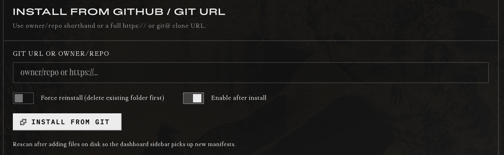

# Installation Guide

Cronalytics installs as a **Hermes dashboard plugin**. The CLI and agent skill ship inside the plugin directory but must be enabled separately — see below.

> **Install path mantra:** Use Hermes-native methods first.

---

## 1. Install the Plugin

### Primary: Dashboard UI (Recommended)

Open the Hermes dashboard and navigate to the **Plugins** tab. Find the **Install from GitHub / Git URL** section and enter either:

- `8bit64k/cronalytics` (owner/repo shorthand)
- `https://github.com/8bit64k/cronalytics.git` (full clone URL)

Check **Enable after install**, then click **Install**.



Click `Rescan Dashboard Extensions` and Hard-refresh your browser (`Ctrl+Shift+R` or `Cmd+Shift+R`) to clear cached JS. The **Cronalytics** tab appears in the sidebar.

The CLI and skill are present in the plugin directory but require separate activation (see sections 3 and 4 below).

### Alternative: Hermes CLI

```bash
hermes plugins install 8bit64k/cronalytics --enable
```

---

## 2. Restart the Dashboard (Required)
To ensure the plugin and api routes get registered correctly we recommend restarting the Hermes dashboard. Use a small delay (`sleep 2`) to ensure the network port is fully released by the OS before starting the new process:

```bash
hermes dashboard --stop && sleep 2 && hermes dashboard
```
*Note: Failure to restart may result in `422 Unprocessable Entity` errors in the browser.*

---

## 3. Register the CLI Add-on

The cronalytics cli tool is bundled with the plugin, but it must be registered separately via `pip` to get the `cronalytics` command on your `$PATH`.

### Primary: Editable pip install (Recommended)

```bash
pip install -e ~/.hermes/plugins/cronalytics
```
*(Arch Linux users (btw) may need to add `--break-system-packages` due to PEP 668. Other distros omit that flag.)*

Then use it from any directory:

```bash
cronalytics summary --days 14
cronalytics jobs --json
cronalytics runs --job _demo_f1561526d8 --days 30
```

### Alternative: Shell alias (no pip)

If you prefer not to use `pip`, add an alias to your shell profile:

```bash
# In ~/.bashrc or ~/.zshrc
alias cronalytics='python -m cronalytics.cli'
```

> **Note:** With the alias method, auto-completion via `argcomplete` is not available. The `cronalytics` command is the fully featured path.

---

## 4. Skill Setup

This ensures the `SKILL.md` and the `references/` subdirectory (containing `data-model.md`, etc.) are correctly placed for the agent to use.

### Primary: Hermes CLI (Recommended) 

```bash
# Fetches the skill from the specific directory and places it in devops/cronalytics/
hermes skills install 8bit64k/cronalytics/skills/cronalytics --category devops
```

### Alternative: The `cp` method 

The diagnostic skill is bundled in the `skills/cronalytics/` directory, so you can use the `cp` method to install it along with all supporting reference documents:

```bash
# Create the skill directory if it doesn't exist
mkdir -p ~/.hermes/skills/devops/cronalytics

# Copy the skill and its references
cp -r skills/cronalytics/* ~/.hermes/skills/devops/cronalytics/
```

---

## Structure After Install

```
~/.hermes/plugins/cronalytics/
├── plugin.yaml              # Plugin manifest (hooks, version)
├── __init__.py              # Register hook + bootstrap scanner
├── cronalytics/             # Core package
│   ├── cli.py              # Terminal interface (entry point)
│   ├── config.py           # Paths + defaults
│   ├── facts.py            # SQLite fact database
│   ├── ingester.py         # Deferred ingestion worker
│   ├── scanner.py          # Backfill + watermark logic
│   ├── schedule.py         # Cron parsing + projection math
│   ├── logger.py           # Shared logger
│   └── checkpoint.py       # Session state persistence
├── skills/
│   └── devops/
│       └── cronalytics/
│           └── SKILL.md    # Built-in diagnostic skill for agents
├── dashboard/
│   ├── manifest.json        # Slot registration + routes
│   ├── plugin_api.py        # REST API mounted at /api/plugins/cronalytics/
│   ├── build.js             # esbuild bundler script
│   ├── src/                 # Modular frontend source
│   └── dist/
│       └── index.js         # Bundled React frontend
└── tests/                   # Unit tests (run with pytest)
```

---

## First-Time Setup

After install, the plugin needs data.

1. **Wait for a cron job to run** — the `on_session_end` hook captures it automatically.
2. **Or trigger a manual backfill** — click **Sync Now** in the dashboard toolbar.

If the dashboard shows "No cron jobs captured," click **Sync Now**.

> **Note on `curl`:** The sync endpoint requires the dashboard's ephemeral session token for security. The token is injected into the SPA and changes on each dashboard restart. If you need to trigger sync from a script, extract the token from `window.__HERMES_SESSION_TOKEN__` in the dashboard page source and pass it as:
> ```bash
> curl -H "X-Hermes-Session-Token: <token>" -X POST http://localhost:9119/api/plugins/cronalytics/sync
> ```
> Most users should use the dashboard **Sync Now** button instead.

---

## Reverse Proxy Setup

If you run the Hermes dashboard behind **Caddy**, **Nginx**, or another reverse proxy, ensure `/api/*` routes are forwarded directly to the dashboard backend. The Hermes dashboard serves the SPA fallback (`index.html`) for any unmatched path, so a misconfigured proxy will return HTML instead of JSON for plugin API calls.

**Common cause:** `try_files` or `rewrite` rules intercepting `/api/*` paths.

**Minimal Caddy example:**

```caddy
# Forward all /api/* routes to the Hermes dashboard backend
reverse_proxy /api/* localhost:9119

# Serve the SPA for everything else
reverse_proxy localhost:9119
```

If you see `Unexpected token '<'` errors in the Cronalytics tab after installing behind a proxy, check this configuration first. See [Troubleshooting](TROUBLESHOOTING.md) for more details.

---

## Requirements

- Hermes Agent v0.10.0+
- `state.db` present at `~/.hermes/state.db` (default Hermes install)
- Dashboard server running (`hermes dashboard`)

## Verification

After install:

1. Open the dashboard sidebar — you should see a **Cronalytics** tab.
2. Click it — the hero banner and toolbar should render.
3. Click **Sync Now** — after a few seconds, the toast should show `✓ Synced N runs`.
4. The Jobs Breakdown table should populate with your cron job history.

---

*Version: 1.1.0*  
*Last updated: 2026-05-23*

---

## Troubleshooting

See [TROUBLESHOOTING.md](TROUBLESHOOTING.md) for common issues and fixes.
