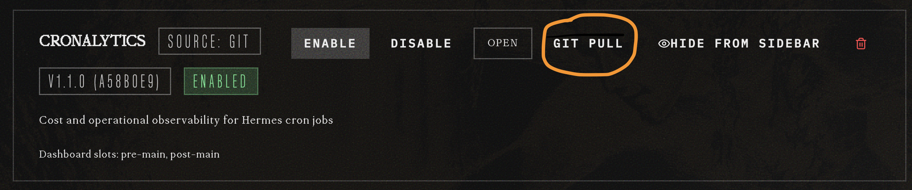

# Upgrading Cronalytics

This guide covers the transition to **Cronalytics v1.1.0**, which introduces a significant architecture change (namespace restructure) to support the new CLI and Agent Skill.

## From v1.0.x to v1.1.0

## 1. Update the Plugin

### Primary: Dashboard UI (Git Pull method) (Recommended)

Open the Hermes dashboard and navigate to the **Plugins** tab. Find the Cronalytics plugin listed in the **Installed Plugins** section. Click on 'Git Pull' to pull the latest code.



Click `Rescan Dashboard Extensions` and Hard-refresh your browser (`Ctrl+Shift+R` or `Cmd+Shift+R`) to clear cached JS. The **Cronalytics** tab appears in the sidebar.

### Secondary: Hermes CLI (Alternate)

Pull the latest code using the Hermes CLI:
```bash
hermes plugins update cronalytics
```

## 2. Restart the Dashboard (Required)
Because v1.1.0 changes the internal Python namespace and API validation patterns, you **must** stop and start the dashboard to clear the old code from memory. Use a small delay (`sleep 2`) to ensure the network port is fully released by the OS before starting the new process:

```bash
hermes dashboard --stop && sleep 2 && hermes dashboard
```
*Note: Failure to restart may result in `422 Unprocessable Entity` errors in the browser.*

## 3. Register the CLI Add-on

The cronalytics cli tool is bundled with the plugin, but it must be registered separately via `pip` to get the `cronalytics` command on your `$PATH`.

### Primary: Editable pip install (Recommended)

```bash
pip install -e ~/.hermes/plugins/cronalytics
```
*(Arch Linux users (btw) may need to add `--break-system-packages` due to PEP 668. Other distros omit that flag.)*

Then use it from any directory:

```bash
cronalytics summary --days 14
cronalytics jobs --json
cronalytics runs --job _demo_f1561526d8 --days 30
```

### Alternative: Shell alias (no pip)

If you prefer not to use `pip`, add an alias to your shell profile:

```bash
# In ~/.bashrc or ~/.zshrc
alias cronalytics='python -m cronalytics.cli'
```

> **Note:** With the alias method, auto-completion via `argcomplete` is not available. The `cronalytics` command is the fully featured path.

---

## 4. Skill Setup

This ensures the `SKILL.md` and the `references/` subdirectory (containing `data-model.md`, etc.) are correctly placed for the agent to use.

### Primary: Hermes CLI (Recommended) 

```bash
# Fetches the skill from the specific directory and places it in devops/cronalytics/
hermes skills install 8bit64k/cronalytics/skills/cronalytics --category devops
```

### Alternative: The `cp` method 

The diagnostic skill is bundled in the `skills/cronalytics/` directory, so you can use the `cp` method to install it along with all supporting reference documents:

```bash
# Create the skill directory if it doesn't exist
mkdir -p ~/.hermes/skills/devops/cronalytics

# Copy the skill and its references
cp -r skills/cronalytics/* ~/.hermes/skills/devops/cronalytics/
```

## Troubleshooting Upgrade Issues

### 422 Error: string_pattern_mismatch
**Symptoms:** Dashboard fails to load; browser console shows 422 error on `outcome` or `mode`.
**Cause:** Old v1.0 code is still running in the Gateway/Dashboard memory.
**Fix:** Run the robust restart sequence (`hermes dashboard --stop && sleep 2 && hermes dashboard`) and perform a hard refresh in your browser (`Ctrl+Shift+R`).

### Missing Command: `cronalytics`
**Cause:** The CLI is an optional entry point that must be registered via pip.
**Fix:** Run the `pip install -e` command listed in Step 3 above.

---

## More Resources

- [Installation Guide](INSTALL.md)
- [Troubleshooting Guide](TROUBLESHOOTING.md) — See here for more details on 422 errors and dashboard issues.
